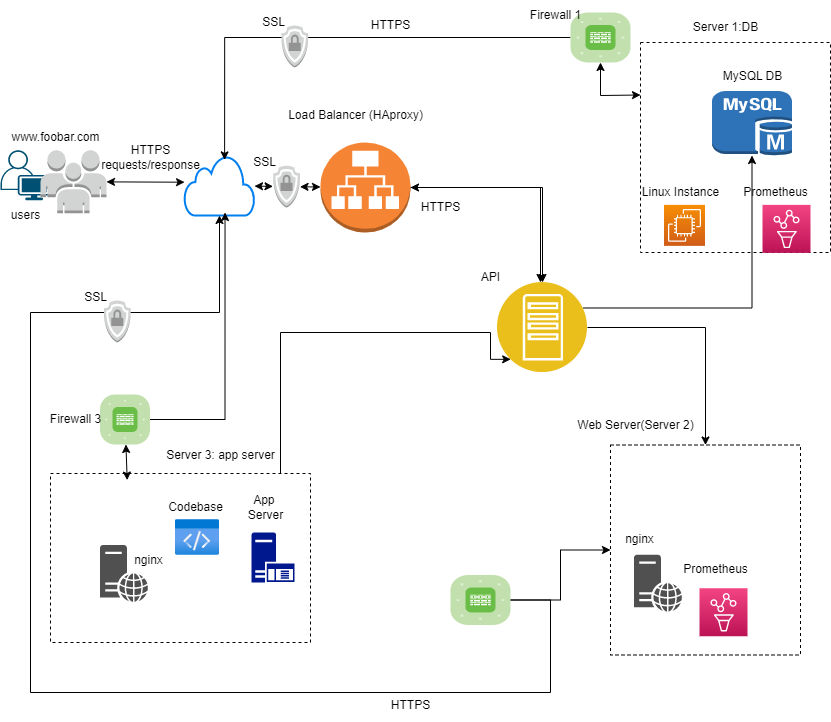

# What Happens When You Type `google.com` in Your Browser and Press `Enter`?

This is an article-like markdown that aims to explain the step-by-step process that occurs when you enter **"google.com"** in your web browser and press the `enter` key. In this context, we will explore each stage of the workflow, from the initial `DNS` request to the final `DOM rendering` of the webpage.

> [Web Infrastructure Diagram](./img_blog/web_infra.png):
<div align="center">
    
</div>


## Table of Contents

- [Premise](#premise)
- [DNS Request](#dns-request)
- [TCP/IP](#tcpip-stack)
- [Firewall](#firewall)
- [HTTPS/SSL](#https-and-ssl)
- [Load Balancer](#load-balancer)
- [Web Server](#web-server)
- [Application Server](#application-server)
- [Database](#database)
- [Conclusion](#conclusion)

<br/>

### What DNS IS
> **Note**  
> **DNS background**:  
> Please read this short non-technical excerpt before moving on to the rest of this article.

# "

`DNS` (Domain Name System) is a fundamental part of how the internet works, providing a way to translate human-readable domain names (such as google.com) into machine-readable IP addresses (such as 172.217.170.174). It serves as a directory or phonebook of the internet, enabling us to access websites, send emails, and perform various online activities.

Think of DNS as a system that maps domain names to the corresponding IP addresses. When you type a domain name into your web browser and hit Enter, the browser needs to find the IP address associated with that domain to establish a connection and load the webpage.

DNS working:

1. **Domain Registration**: When a person or organization wants to create a website, they register a unique domain name through a domain registrar. This registration and follow up configuration links the domain name to the IP address of the server where the website's files are hosted.

2. **DNS Servers**: DNS operates using a distributed network of servers worldwide. These servers store DNS records that contain information about domain names and their corresponding IP addresses.

3. **DNS Resolution**: When you type a domain name into your browser, your computer first checks its local DNS cache (a temporary storage of previously resolved domain names). If the domain name is not found in the cache or it has expired, your computer sends a DNS query to a DNS resolver.

4. **DNS Resolver**: Your computer's operating system or internet service provider (ISP) usually provides a DNS resolver. The resolver is responsible for handling DNS queries and finding the IP address associated with the domain name.

5. **Recursive DNS Resolution**: The resolver starts by contacting one of the root DNS servers. These servers maintain information about the top-level domains (TLDs) like .com, .org, .tech, or .net. The root DNS server then directs the resolver to the appropriate TLD DNS server.

6. **TLD DNS Server**: The TLD DNS server knows the specific authoritative DNS server for the domain in question. It provides the resolver with the IP address of the authoritative DNS server.

7. **Authoritative DNS Server**: The authoritative DNS server is responsible for storing and providing the DNS records for a particular domain. It holds the mapping between the domain name and the corresponding IP address.

8. **Response and Caching**: The authoritative DNS server responds to the resolver with the IP address. The resolver caches this information to expedite future requests for the same domain. It also returns the IP address to the requesting computer, allowing the browser to establish a connection with the web server and retrieve the webpage.

Throughout this process, multiple DNS servers collaborate to resolve the domain name and provide the correct IP address. The DNS system is designed to be efficient, reliable, and scalable, ensuring quick and accurate resolution of domain names.

Overall, DNS simplifies the process of accessing websites by translating easy-to-remember domain names into the numeric IP addresses that computers understand. It plays a crucial role in facilitating seamless communication and accessibility on the internet.

# "

<br/>

## Premise

When you type `"https://www.google.com"` in your browser and press `enter` on your keyboard, a series of intricate processes unfold under the hood to deliver the webpage. Understanding these processes is crucial for gaining insights into the infrastructure side of web development. In this blog post, we will explore the step-by-step journey of a web request, from the initial DNS resolution to the final rendering of the webpage case by case.


## DNS Request 

```bash
festus-m@HP:~$ dig +short A google.com
172.217.170.174
festus-m@HP:~$ dig google.com

; <<>> DiG 9.16.1-Ubuntu <<>> google.com
;; global options: +cmd
;; Got answer:
;; ->>HEADER<<- opcode: QUERY, status: NOERROR, id: 42604
;; flags: qr rd ad; QUERY: 1, ANSWER: 1, AUTHORITY: 0, ADDITIONAL: 0
;; WARNING: recursion requested but not available

;; QUESTION SECTION:
;google.com.                    IN      A

;; ANSWER SECTION:
google.com.             0       IN      A       172.217.170.175

;; Query time: 0 msec
...
;; WHEN: Wed Jul 16 20:58:00 EAT 2023
;; MSG SIZE  rcvd: 54

festus-m@HP:~$
```

The first step in loading a webpage is the `DNS`request. When you enter "google.com" in your browser, it needs to resolve the domain name to its corresponding IP address. The browser sends a DNS request to a DNS server, which then looks up the IP address associated with the domain name. This process involves multiple DNS servers, starting from the browser's local cache to recursive DNS servers and authoritative DNS servers. Once the IP address is obtained, the browser can proceed with establishing a connection to the server.

View the *shell session* above (using UNIX's command-line tool `dig`); for reference on how DNS maps hostnames to IP addresses and how DNS queries are resolved. **dig** stands for "domain information groper". The dig command allows you to retrieve various types of DNS information and perform DNS lookups, providing detailed insights into DNS resolution processes. This is a similar process in a web browser request.


> This image visually represents the DNS request process


## TCP/IP Stack
TCP/IP stands for Transmission Control Protocol/Internet Protocol. TCP/IP is a set of standardized rules that allow computers to communicate on a network such as the internet.

Computers communicate with each other using `IP addresses`. Many of the things we think about computers doing – whether it’s sending email messages, watcing anime online, watching Netflix, or getting directions – involve computers communicating.

Any given interaction may be between two computer systems, or it may involve hundreds of systems. But, like passing a letter or a package from hand to hand, each transaction occurs between just two computers at a time. For this to happen, the two computers need to know, ahead of time, how they are expected to communicate.

```bash
How do they start the conversation?
Whose turn is it to communicate?
How does each computer know its message was transmitted correctly?
How do they end the conversation?
```

Well, when computers all use the same protocol and the TCP/IP standard, information can be transferred. When they don’t, it’s chaos.

`IP` is the part that obtains the address to which data is sent. TCP is responsible for data delivery once that IP address has been found.

It's possible to separate them, but there isn’t really a point in making a difference between TCP and IP. Because they're so often used together, as “TCP/IP” stack.


### What does TCP/IP do, exactly? And how does it work?
TCP/IP puts a lot of emphasis on accuracy, and it has several steps to ensure that data is correctly transmitted between the two computers. The stack breaks each message into packets, and those packets are then reassembled on the other end. In fact, each packet could take a different route to the other computer, if the first route is unavailable or congested.

Theoretically, TCP/IP divides the different communications tasks into layers. Each layer has a different function. Data goes through four individual layers before it is received on the other end. TCP/IP then goes through these layers in reverse order to reassemble the data and to present it to the recipient.

<div align="left">
    
</div>

> *TCP/IP data packets transfer process*


## Firewall
Firewalls analyze and filter network traffic to protect against unauthorized access.
They act as a barrier between the browser and the server, analyzing and filtering network traffic to prevent unauthorized access. Firewalls enforce security policies based on rules and configurations, allowing or blocking specific types of traffic. When the browser sends a request to the server, the firewall examines the packets to ensure they comply with the defined security rules.

### Examples of generic firewall rules for: google.com

1. **Outbound Traffic Filtering**: Firewalls can be configured to filter outgoing traffic from an organization's network. In some cases, a firewall may restrict access to certain websites or IP addresses, including google.com, to enforce security policies or prevent unauthorized data exfiltration.

2. **Port Restrictions**: Firewalls often restrict access to specific ports. For web browsing, outbound access is typically allowed on ports 80 (HTTP) and 443 (HTTPS). These ports are commonly used for accessing websites, including google.com. If the firewall blocks these ports, it would prevent access to the website.

3. **Protocol Restrictions**: Firewalls may enforce restrictions on specific protocols. For accessing websites, the HTTP and HTTPS protocols are relevant. If a firewall blocks or allows the HTTP or HTTPS protocol, it would impact accessing websites, including google.com.

This is an example of protocol restriction in `Nginx`, allowing HTTP traffic on port 80 through the firewall:
```bash
$ cat nginx_config.sh
#!/usr/bin/env bash
# bash: script install and configure Nginx web server:

sudo apt-get update -y
sudo apt-get install -y nginx

# configure Nginx
ufw allow 'Nginx HTTP'
sudo sed -i 's/80 default_server/80/' /etc/nginx/sites-available/default
sudo service nginx restart

# create index.html file served out by server:
echo 'Hello World!' | sudo tee /var/www/html/index.html > /dev/null
```

4. **Application-Level Filtering**: Some firewalls perform application-level filtering to inspect and control web traffic. These firewalls can analyze the content of HTTP/HTTPS requests and responses. Organizations may have specific policies in place to monitor or block certain types of content or specific URLs, potentially including google.com.

5. **IP Whitelisting/Blacklisting**: Firewalls can maintain lists of trusted or blocked IP addresses. In some cases, an organization may have specific IP addresses associated with google.com either whitelisted or blacklisted. Whitelisting allows access only from approved IP addresses, while blacklisting blocks access from specific IP addresses.


## HTTPS and SSL
`HTTPS` (Hypertext Transfer Protocol Secure) uses `SSL` (Secure Sockets Layer) or `TLS` (Transport Layer Security) for securing a website or web application; [www.google.com](https://www.google.com) in this context. It ensures secure communication between the client(your browser) and the server by encrypting data transmission, preventing unauthorized interception or tampering.  SSL/TLS certificates are used to authenticate the server's identity and establish a secure connection. This encryption process safeguards sensitive information, such as login credentials or financial data, from potential eavesdropping or data breaches.

### `How Does HTTPS Work, Ey?`
HTTPS pages typically use one of two aforeamentioned protocols. Both the TLS and SSL protocols use what is known as an 'asymmetric' Public Key Infrastructure (PKI) system. An asymmetric system uses two 'keys' to encrypt communications, called a key-pair which includes a 'public' key and a 'private' key. Anything encrypted with the public key can only be decrypted by the private key and vice-versa. Encryption means that the sender and recipient agree upon a "code" and translate their documents into random-looking character sequence strings which can only be deciphered with private keys.

### What a HTTPS certificate IS
An SSL/TLS certificate can be generated using a trusted provider e.g ***Electronic Frontier Foundation*** (EFF) using [`certbot`](https://certbot.eff.org/instructions?ws=haproxy&os=ubuntufocal).

When you request a HTTPS connection to a webpage, the website will initially send its SSL certificate to your browser. This certificate contains the public key needed to begin the secure session. Based on this initial exchange, your browser and the website then initiate the 'SSL handshake'. The SSL handshake involves the generation of shared secrets to establish a uniquely secure connection between yourself and the website.

> Telling a Secure Connection From Insecure:  
> Most modern web browsers display a padlock icon in the address bar to visually indicate that a HTTPS connection is in effect. When an Extended Validation Certificate is installed on a web site, the address bar will turn green.


> *Copyright*: Digital Ocean

> Read More On:  
> [Digital Ocean](https://www.digitalocean.com/community/tutorials/how-to-secure-haproxy-with-let-s-encrypt-on-ubuntu-14-04)


## Load Balancer
***Load balancers*** handle high traffic loads and ensure optimal performance. They distribute incoming network traffic across multiple servers, known as a server cluster. They help optimize resource utilization, improve scalability, and enhance availability by evenly distributing requests. Load balancers can use various algorithms to determine which server should handle each incoming request, considering factors like server health, capacity, or proximity to the user. Load balancers ensure high availability by distributing the work-load of your system to multiple individual systems, or group of systems to to reduce the amount of load on an individual system, which in turn increases the reliability, efficiency and high availability of your enterprise application or website. This technically is a fail-safe mechanism to improve actual system performance.  
There are software and hardware load balancers. Software load balancers generally implements a combination of one or more scheduling algorithms e.g. in a round robin fashion, scheduling algorithms meant to direct traffic to servers with the least connection at the moment of the request, and others meant to redirect traffic based on weight assigned to servers based on the hardware architecture/capabilities.

Common examples of industry load balancers are:
- HAProxy – A TCP load balancer.
- NGINX – A http load balancer with SSL termination support. (install Nginx on Linux)
- mod_athena – Apache based http load balancer.

See the script below for configuring a HAProxy server to distribute traffic to servers.

```bash
#!/usr/bin/env bash

...
# configure HAProxy
sudo mv /etc/haproxy/haproxy.cfg /etc/haproxy/haproxy.cfg.backup

echo "
frontend frontend_http
    bind *:80
    mode http
    default_backend backend_http

backend backend_http
    mode http
    balance roundrobin
    server host-server-name server-ip:80 check
    server host-server-name server-ip:80 check
" | sudo tee /etc/haproxy/haproxy.cfg > /dev/null
...
```
> You don't have to understand the script above. But this is what it does: it specifies servers to send requests to in a round robin manner. The load balancer/HAProxy in this case stands in front of your servers and is hit first by the request, and it decides which server to send the rquest to.  

> **Load-balancing example**:  
>> Imagine a popular e-commerce website that experiences a surge in traffic during a holiday season sale. The website utilizes a load balancer to manage the increased influx of requests. The load balancer receives incoming requests from users and intelligently distributes them across several backend servers in the server farm. It uses an algorithm, such as round-robin, least connections, or weighted distribution, to determine which server should handle each request. This ensures that the workload is evenly distributed among the servers, optimizing resource utilization and preventing any single server from becoming overloaded.


## Web Server
Once the request passes through the load balancer, it reaches the web server responsible for serving out the requested web content. Web servers, such as Apache HTTP Server or Nginx, handle incoming HTTP requests and respond with the corresponding static content e.g. HTML, CSS, JavaScript, and other web files. They communicate with the browser using the HTTP protocol, processing the request and returning the appropriate response, which includes the webpage's content, status codes, and headers.
Apache or Nginx web servers play a role in processing HTTP requests, basically.

> **Example**:  
>> Consider a news website where users can browse articles and access multimedia content. When a user clicks on a specific article, their request is sent to the web server. The web server receives the request, retrieves the relevant article's content from a database or a file system, and generates an appropriate response. This response includes the HTML, CSS, JavaScript, and other necessary files that make up the webpage. The web server communicates with the browser using the HTTP protocol, ensuring that the requested content is delivered and displayed correctly.  

> **Infrastructure Diagrams are Nice!**:  
> View our first diagram for reference on where a web server lies on the stack. [Take Me to the Top](#what-happens-when-you-type-google.com-in-your-browser-and-Press-enter?)


## Application Server
For dynamic web applications, an application server plays a crucial role. It hosts and executes server-side scripts or applications, processing data and generating dynamic content that can be displayed on the webpage. Application servers, like `Tomcat` or `Node.js`, interact with the web server to handle specific tasks, such as executing server-side code, querying databases, or integrating with external services. They provide the necessary runtime environment and services for the web application to function properly.

> **Example**:  
>> Imagine a social media platform where users can post updates, follow other users, and engage in various activities. The application server is responsible for handling these dynamic interactions. When a user submits a post or performs an action, such as following another user, the application server processes the request. It executes server-side scripts or applications, which can be written in languages like Java, Python, or Node.js, to perform the necessary operations. This may include updating the database, generating personalized content, executing complex algorithms, or interacting with external services or APIs.


## Database
Web applications often rely on databases to store and retrieve data. When processing user requests, the application server may interact with a database management system (DBMS), such as `MySQL`, `PostgreSQL`, or `MongoDB`. The DBMS manages the storage, retrieval, and manipulation of structured or unstructured data. The application server sends queries to the database to fetch or update information, enabling the web application to provide personalized and dynamic content based on user interactions.

> `Example Scenario`:  
>> In an online shopping website, the application server interacts with a database management system (DBMS) to store and retrieve product information, user profiles, order details, and other relevant data. When a user adds an item to their cart, the application server sends a query to the database to update the inventory and record the purchase. Similarly, when a user searches for a specific product, the application server queries the database to retrieve relevant information. The database allows the web application to provide personalized and dynamic content based on user interactions, ensuring efficient data management and retrieval.

> Please review our Infrastructure Diagram for reference on databases and application servers.


## Conclusion
And that is about it! I hope this write-up provides insights, to you the reader, into how the internet functions and how web applications are delivered to end-users. I learned more about DNS as I prepped this. And I wished that by unraveling these technical details, you gain a deeper understanding of the complex processes that power the web. If you liked my stuff, buy me coffee :)


## References:
> 1. Working With HTTPS in Load Balancing: [Digital Ocean](https://www.digitalocean.com/community/tutorials/how-to-secure-haproxy-with-let-s-encrypt-on-ubuntu-14-04)  
> 2. What HTTPS IS - on [instantssl](https://www.instantssl.com/http-vs-https).  
> 3. What HTTP IS - [HTTP IETF-rfc](https://datatracker.ietf.org/doc/html/rfc7540)  
> 4. HTTP Specification [view on Internet Engineering Task Force (IETF)-rfc ](https://www.ietf.org/rfc/rfc4251.txt)  
> 5. What is TCP/IP and How Does it Work? [view-source on avast.com](https://www.avast.com/c-what-is-tcp-ip#)  